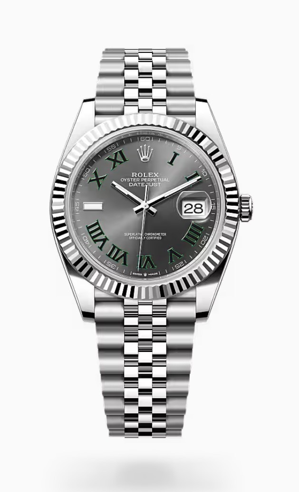
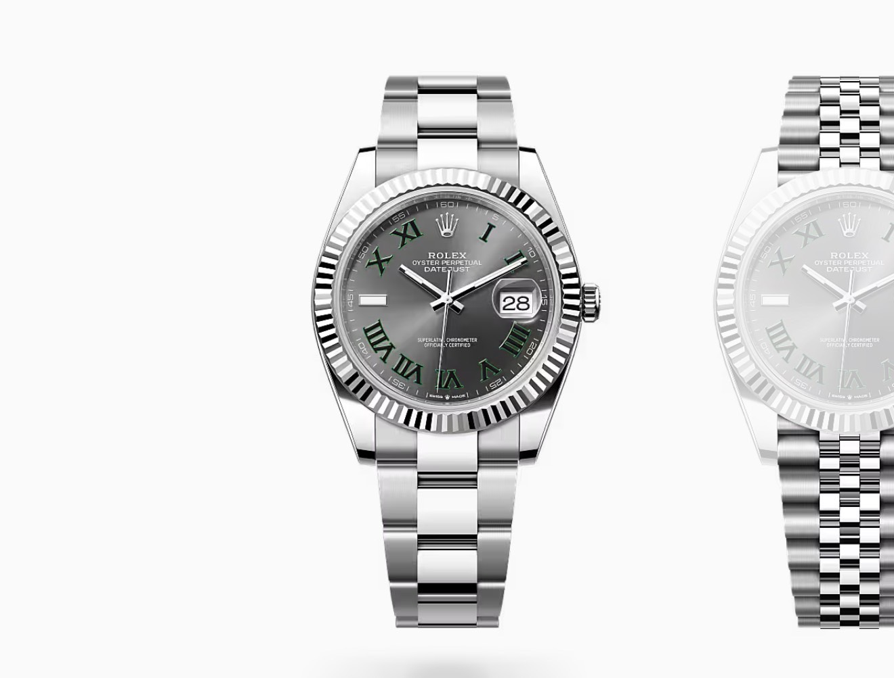
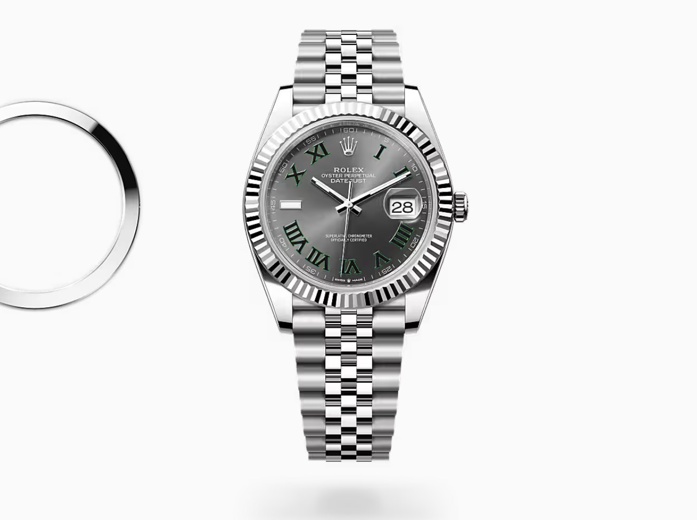
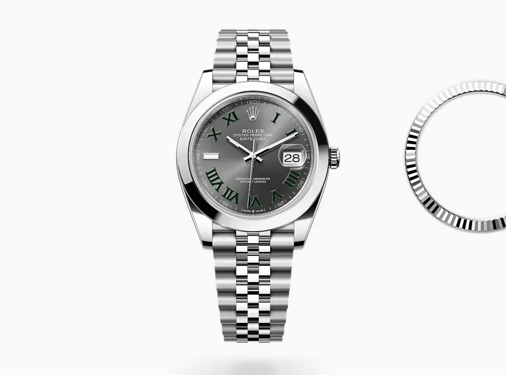
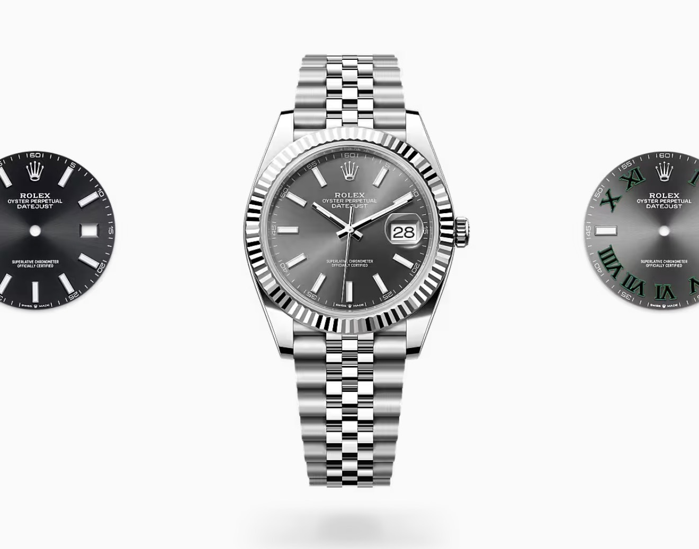
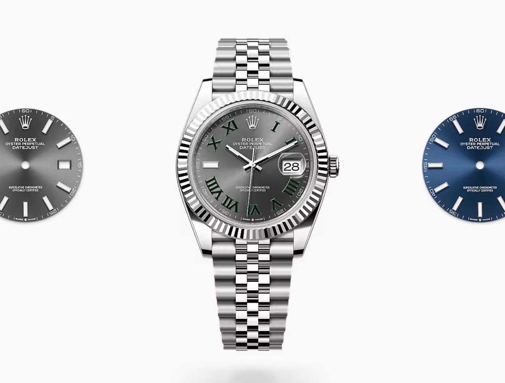
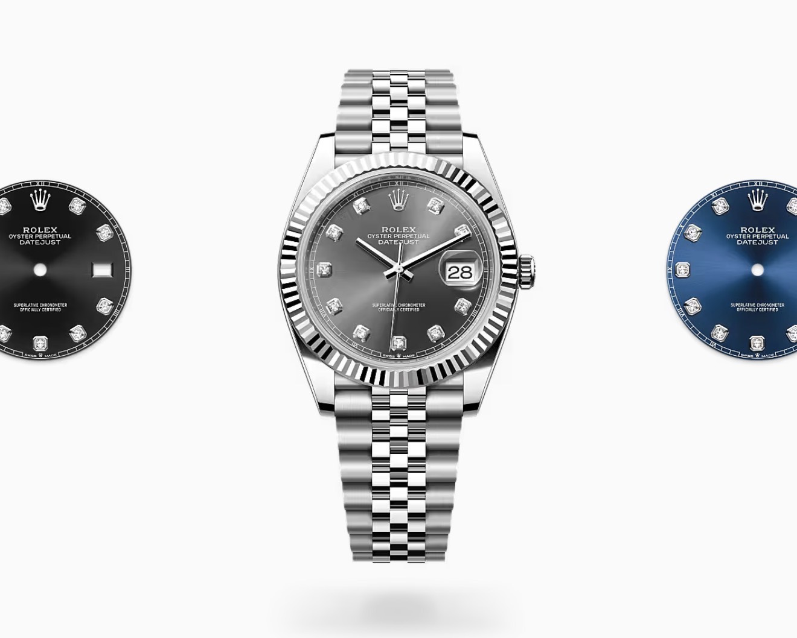

# ［セカンド］攻略マニュアル 〜Rolex デイトジャスト41 購入〜

> 対象：これから店舗に挑戦するメンバー
> 最終更新：2026-08-05

---

## はじめに（必ず読んでください）

今回の件は
**「とりあえず並んで、運が良ければ案内される」というものではありません。**

店舗側は、**転売ヤーの見極めのプロ**です。

- 時計の知識
- 身だしなみ
- 話し方
- 立ち振る舞い
- 将来性
- 姿勢

こういった点を**総合的に**見て、
「この人なら案内しても大丈夫」と判断した人だけに提案しています。

逆に、知識不足や受け答えが曖昧な状態で行くと、
**せっかくの機会を逃してしまう可能性があります！**

だからこそ、**最短で結果を出せる状態**で挑戦してほしいと思っています。

全員が最短で結果を出せるようサポートするので、一緒に頑張りましょう！

---

## 挑戦までの流れ（合格制）

```
① 紹介者が「基礎レクチャー」を実施
        ↓
② 拳慎さんが「最終ロープレ・レクチャー」を実施
        ↓
③ 合格した人から順番に挑戦 👍
```

準備が整った人から挑戦してもらいます。焦らず、まずは合格を目指しましょう。

---

## ⚠️ 最重要ルール：来店前に必ず連絡する

**間違ったモデルを買ってしまうと、最大 −30万円の損失になる可能性があります。**

自己判断で勝手に動くと、この損失を**あなた自身が被る**ことになります。
どのモデルが「買い」なのかは、その時々で変わります。だからこそ——

> ### 🔴 来店する前に、必ず「今から来店します」と連絡を入れてください。
>
> - 連絡なしの**独断行動は厳禁**です。
> - 連絡 → 指示を受けてから動く。これを必ず守ってください。

このルールを守れば、間違ったモデルを買うリスクはゼロになります。
逆に、勝手に動いて損失が出た場合は自己責任になるので、**絶対に事前連絡を徹底**しましょう。

---

## ① 来店〜購入までの流れ

### 1. 来店（一次面接）

店舗へ入店。店員さんから簡単な質問をされます。

- 「何かお探しですか？」
- 「どのモデルをご希望ですか？」

**ここで見られていること**

- 希望モデル → **デイトジャスト 41mm**
- 時計が好きか
- 転売目的ではないか

を軽くチェックされています。

### 2. 二次面接（販売員との会話）

在庫確認の前に、会話が続くことが多いです。

**よくある質問**

- なぜこのモデル？
- 他にもロレックスを持っている？
- なぜ買おうと思った？
- 普段どんな時計を着けている？
- 普段は何をしている？

> 👉 これらの受け答えを、事前のロープレでしっかり固めておきます。

### 3. 在庫確認

店員さんが「少々お待ちください」と言って裏へ行きます。

ここで次の判断が行われます。

- 在庫確認
- 上司確認
- 販売可否

### 4. 在庫確認終了

**■ 購入できる場合** → 奥の部屋に案内されます。

```
品物が出てくる
     ↓
悩んでいるフリなどをしながら、時計の写真を撮る
     ↓
拳慎さんに時計の写真を送る
     ↓
利益が出る時計なら「GOサイン」が出る
     ↓
「購入します」とスタッフに伝える
```

**📸 写真を撮るときの声かけ**

黙って撮ると不自然です。次のように**ひと言かけてから**撮りましょう。

> 「**親父に工面してもらってるので、報告したいので写真いいですか！？**」

親（家族）に相談・報告するための自然な流れとして伝えれば、
怪しまれずに写真を撮ることができます。

**■ 購入できない場合** → 「在庫がありませんでした」と伝えられます。

### 5. 購入

購入には **店頭購入パターン** と **予約購入パターン** の2種類があります。

#### ［店頭購入パターン］— その日に購入できる

**必要なもの**

- 現金
- 本人名義のクレジットカード
  （クレカが止まっている人は**キャッシュカード**）

**流れ**

```
「現金を下ろしてきます」と伝える
     ↓
事務所へ現金を受け取りに行く
     ↓
店舗に戻り、支払いを完了
     ↓
時計を事務所に持っていって終了
```

#### ［予約購入パターン］— 在庫はないが売ってくれる

入荷されると**ロレックスから連絡**が来ます。

```
入荷連絡が来る
     ↓
事務所で現金を受け取る
     ↓
店舗へ購入しに行く
```

---

## ② 基礎知識：デイトジャスト41の選び方

デイトジャスト41は「**① ブレスレット × ② ベゼル × ③ 文字盤**」の組み合わせで印象が決まります。



> ↑ 迷ったときの鉄板＝**ジュビリー × フルーテッド × グレー文字盤（緑ローマ／通称ウィンブルドン）**

### ① ブレスレット




| 種類 | 特徴 | おすすめの人 |
|------|------|--------------|
| **オイスターブレス** | スポーティー／シンプル／傷が目立ちにくい／普段使い向き | カジュアル・毎日使いたい人 |
| **ジュビリーブレス** | 高級感がある／キラキラして見える／着け心地が柔らかい／デイトジャストの定番 | スーツ・高級感・資産価値重視 |

### ② ベゼル

| 種類 | 特徴 | おすすめの人 |
|------|------|--------------|
| **ドーム（スムース）ベゼル** | シンプル／落ち着いた印象／ビジネス向き | 飽きが来ないデザインが良い人 |
| **フルーテッドベゼル** | ギザギザ加工／光を反射して高級感抜群／一目でロレックスらしい | 人気・資産価値・存在感重視 |

| フルーテッド（人気） | ドーム／スムース |
|----------------------|------------------|
|  |  |

### ③ 文字盤

| 種類 | 特徴 | おすすめの人 |
|------|------|--------------|
| **バーインデックス** | シンプル／視認性が高い／一番人気 | 初めてのロレックス |
| **ローマインデックス** | クラシック／上品／大人っぽい印象 | 落ち着いた雰囲気が好きな人 |
| **ダイヤインデックス** | ダイヤ入り／華やか／ラグジュアリー | 高級感・特別感を重視する人 |

**バーインデックス**（左：ブラック／中央：ロジウム／右：ウィンブルドン）



**文字盤カラー展開**（左：シルバー／中央：ウィンブルドン／右：ブルー）



**ダイヤインデックス**（左：ブラック／中央：グレー／右：ブルー）



---

### 人気ランキング・迷ったときは

| | 内容 |
|---|---|
| ⭐ **人気** | ジュビリーブレス／フルーテッドベゼル |
| △ **不人気** | オイスターブレス／ドームベゼル |

**迷ったらこれ**

- ブレス：**ジュビリー**
- ベゼル：**フルーテッド**
- 文字盤：**ダイヤ／ローマ／バー**（※文字盤は基本的になんでも良い）

---

> 利益が確定した案件の配分計算は [`利益配分計算.html`](./利益配分計算.html)、
> 予約者の管理は [`予約者一覧.md`](./予約者一覧.md) を使ってください。
