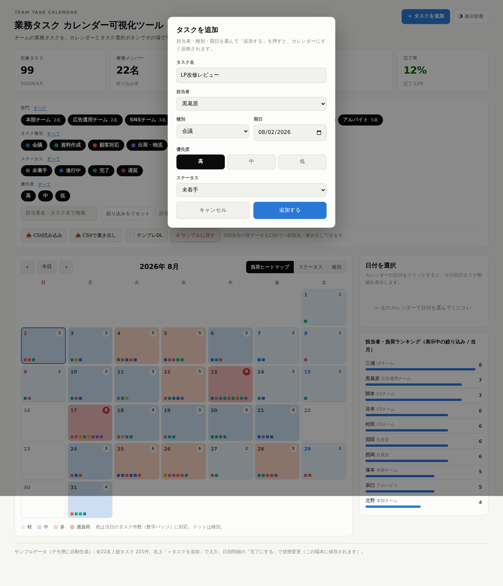
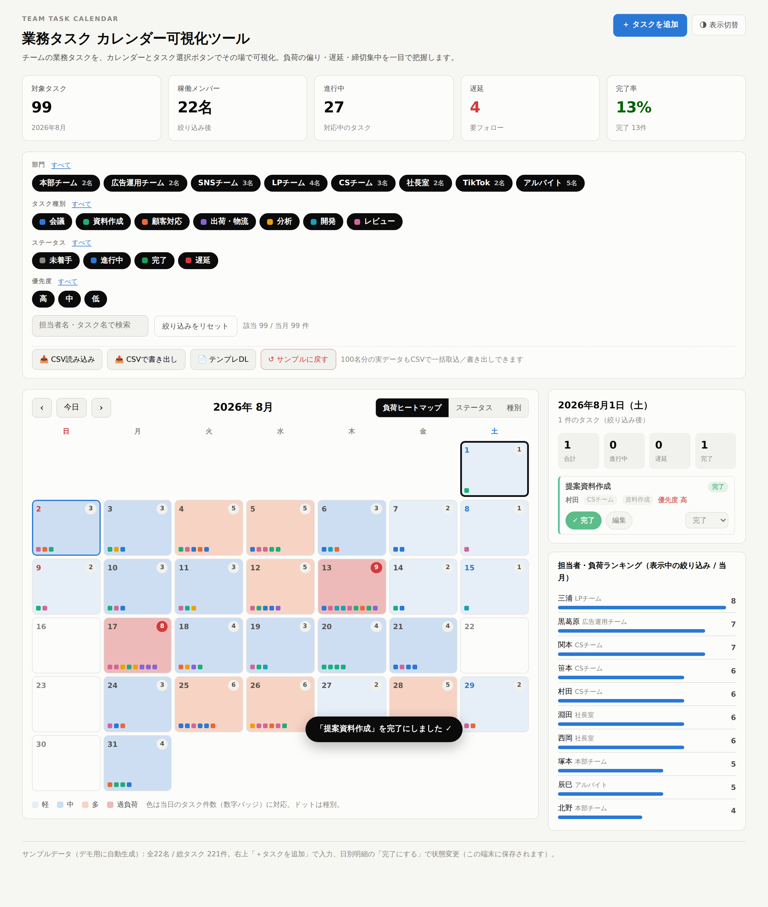

# 業務タスク カレンダー可視化ツール

チームの業務タスクを、**カレンダー**と**タスク選択ボタン（フィルター）**でその場で可視化する単一HTMLツールです。
負荷の偏り・遅延・締切の集中を一目で把握できます。

## つかいかた

`task-calendar/index.html` を **ダブルクリックしてブラウザで開くだけ**です。
インストール不要・サーバー不要・ネット接続不要。1ファイルで完結します。

（実データを入れるまでは、デモ用のサンプルタスクを内部で自動生成して表示します。
チームは「本部チーム・広告運用チーム・SNSチーム・LPチーム・CSチーム・社長室・TikTok・アルバイト」の8チーム。
兼務者（例：黒葛原さん＝広告運用チーム＋LPチーム）は、両方のチームに表示されます。）

## kintone と接続して、実データで動かす

kintone の「業務タスク」アプリと接続し、実データのカレンダー表示と Chatwork 通知ができます。
手順は **[`daily-report-system/docs/task-calendar-setup.md`](../daily-report-system/docs/task-calendar-setup.md)** を参照してください。

```
cd daily-report-system
npm run task:sync     # kintoneから取得 → out/task-calendar.html を生成（実データのカレンダー）
npm run task:watch    # 着手・完了・遅延・停滞を随時 Chatwork へ通知（定期実行）
npm run task:notify   # その日の締切・遅延サマリーを Chatwork へ（毎朝1回）
```

- **随時通知**：`task:watch` を15〜30分おきに実行すると、タスクが「着手／完了／遅延」に
  なった時や「未着手のまま期限が近い（停滞）」時に、その都度 Chatwork に届きます。
- kintone は**読むだけ**（変更しません）。APIトークンは生成HTMLに含めない安全方式です。
- 遅延が含まれるときは `[toall]` で全員に注意喚起します。

## できること

| 機能 | 内容 |
|---|---|
| **タスク選択ボタン** | 「部門 / タスク種別 / ステータス / 優先度」をボタンで ON/OFF して即絞り込み。担当者名・タスク名の検索も可。 |
| **負荷ヒートマップ** | 日ごとのタスク件数を色の濃さで表示。過負荷の日（集中している日）が赤く浮き上がります。 |
| **ステータス表示** | 各日を「未着手・進行中・完了・遅延」の内訳バーで表示。 |
| **種別表示** | 各日に入っているタスク種別を一覧表示。 |
| **日別の明細** | カレンダーの日付をクリックすると、その日のタスク（担当者・部門・種別・優先度・状態）を右側に一覧表示。 |
| **担当者ランキング** | 絞り込み条件に応じた「当月のタスク件数トップ10」を表示。負荷が誰に寄っているかがわかります。 |
| **KPI** | 対象タスク数・稼働メンバー数・進行中・遅延・完了率を上部に常時表示。 |
| **月の移動 / 今日** | 前月・翌月への移動、ワンボタンで今日の月へ。 |
| **明暗テーマ** | 右上「表示切替」でライト／ダーク切替。OSの設定にも追従。 |

## タスクを入力する（追加）

右上の **「＋ タスクを追加」** を押すと入力画面が開きます。

1. **タスク名** を入力（例：提案資料の作成）
2. **担当者** を選ぶ（部門ごとにまとまっています）
3. **種別 / 期日 / 優先度 / ステータス** を選ぶ
4. **「追加する」** を押すと、その日のカレンダーにすぐ反映され、明細に表示されます



## タスクを完了にする

カレンダーの日付をクリック → 右の明細で、各タスクの **「完了にする」** を押すだけです。

- 完了にすると、ボタンが緑の **「✓ 完了」** に変わり、タスク名に取り消し線が付きます（もう一度押すと戻せます）
- 「完了率」や日別の完了数もその場で更新されます
- 細かく状態を変えたいときは、右側の **プルダウン**（未着手／進行中／完了／遅延）で切り替えられます



> **保存について**：追加したタスク・変更したステータスは、その端末のブラウザに保存され、閉じても残ります。
> チーム全員でリアルタイム共有したい場合は、下記のとおり保存先を kintone 等のサーバーに差し替えます。

## タスクを編集・削除する

日別明細で各タスクの **「編集」** を押すと、追加と同じ画面が開いて内容を直せます。
不要になったタスクは、その画面の **「削除」** で消せます。

## 実データを一括で入れる（CSV）

サンプルではなく **実際のタスク表** を使いたいときは、フィルター下の CSV ボタンを使います。

| ボタン | 内容 |
|---|---|
| 📄 **テンプレDL** | 記入用のCSVテンプレートをダウンロード（列の見本つき） |
| 📥 **CSV読み込み** | 記入したCSVを読み込んで、カレンダーに一括反映 |
| 📤 **CSVで書き出し** | 今のタスクをCSVに書き出し（バックアップ・共有用） |
| ↺ **サンプルに戻す** | 追加・編集・取り込みをすべて消して初期状態へ |

**CSVの列（この順番）**

```
日付, タスク名, 担当者, 部門, 種別, 優先度, ステータス
2026-08-15, 提案資料の作成, 山田 太郎, 営業部, 資料作成, 高, 未着手
```

- 日付は `2026-08-15` でも `2026/08/15` でもOK
- 部門：営業部 / マーケ部 / CS部 / 商品部 / 物流部 / 開発部 / 管理部 / 新チーム
- 種別：会議 / 資料作成 / 顧客対応 / 出荷・物流 / 分析 / 開発 / レビュー
- 優先度：高 / 中 / 低
- ステータス：未着手 / 進行中 / 完了 / 遅延
- CSVに無い担当者は自動で登録されます（Excel対応の文字コードで読み書き）

Excel でこの表を作って「CSV読み込み」すれば、**100名分でもそのまま可視化**できます。

## 印刷・PDF

ブラウザの印刷（Ctrl/Cmd + P）で、ボタン類を除いたカレンダーをそのまま印刷・PDF保存できます（会議資料に便利）。

## 実データ（kintone 等）に差し替える

サンプルの生成部分（`MEMBERS` と `TASKS`）を、実際のデータに置き換えるだけで運用できます。
1タスクは次の形です。

```js
{
  id: "t1",
  title: "提案資料作成",     // タスク名
  cat: "doc",               // 種別: meeting/doc/cs/ship/analyze/dev/review
  dept: "sales",            // 部門: sales/mkt/cs/prod/logi/dev/admin
  member: "u1",             // 担当者ID
  memberName: "佐藤 太郎",   // 担当者名
  status: "doing",          // 状態: todo/doing/done/late
  prio: "高",               // 優先度: 高/中/低
  y: 2026, mo: 7, d: 15,    // 年 / 月(0始まり) / 日
  key: "2026-08-15"         // 日付キー YYYY-MM-DD
}
```

kintone のレコードを取得して、この形に整形して `TASKS` に流し込めば、そのまま本番のダッシュボードになります
（部門・種別・状態のマスタは冒頭の `DEPTS` / `CATS` / `STATUSES` で調整できます）。
